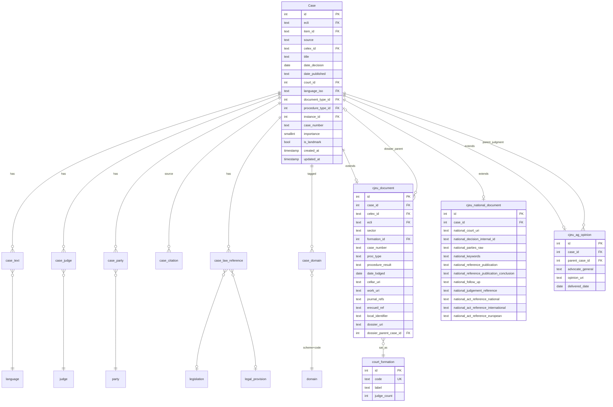

# CJEU corpus → Postgres schema proposal

> **Status:** draft for review — David & colleague, June 2026
> **Source dataset:** [davidwickerhf/cjeu-opendata](https://huggingface.co/datasets/davidwickerhf/cjeu-opendata)
> **Scope:** 46,180 cases × 107 cols (post extractor-v2 + multi-language top-up) + ~1M (post-topup) fulltext rows.

This document maps the CJEU corpus into your existing `cle_v2` Postgres ERD.
Nothing in the live schema is touched — CJEU populates the new tables your
colleague added to the ERD, plus two small additions called out below.

---

## TL;DR for the colleague

You designed 32 tables. CJEU touches **11** of them directly, **feeds** 4 more
that downstream pipelines compute, and doesn't apply to **17**. Two new
tables are needed for CJEU (`cjeu_national_document`, `court_formation`).

| Status | Count | Tables |
|---|---:|---|
| ✏️ **CJEU populates** | 11 | `Case`, `case_text`, `case_citation`, `case_law_reference`, `case_judge`, `case_party`, `case_domain`, `cjeu_document`, `cjeu_ag_opinion`, `judge`, `party` |
| 🔁 **CJEU feeds** (downstream pipelines populate) | 4 | `case_segment`, `case_entity`, `case_cluster*`, `case_network_metric` |
| ➕ **NEW (proposed)** | 2 | `cjeu_national_document`, `court_formation` |
| 🔗 Lookup / reference, used as-is | 8 | `court`, `document_type`, `domain`, `instance`, `jurisdiction`, `language`, `legal_provision`, `legislation`, `procedure_type` |
| ❌ Other-source / not applicable | 9 | `echr_document`, `echr_document_appno`, `rs_document`, `rs_document_external_authority`, `rs_document_formal_relation`, `rs_document_publication`, `legislation_alias`, `lido_link`, `search_query_log`, `network_snapshot` |

---

## ER diagram (CJEU-relevant subset)

---

## How CJEU populates each table

### `Case` (existing — populate)

> Most fields exist. I'm flagging a few decisions to make at load time.

| Existing column | Source HF column / derivation |
|---|---|
| `id` | autogenerated |
| `ecli` | `cases.ecli` |
| `item_id` | ❓ **unclear** — FK to what? See open question Q1 |
| `source` | constant `'CJEU'` |
| `celex_id` | `cases.celex` (first `;`-token) |
| `title` | ❓ **unclear** — CELLAR has `work_title` but populated for only 1.3% of cases. Leave NULL? Synthesize from CELEX + parties? See Q2 |
| `date_decision` | `cases.date_publication` (first token) — the CELLAR "date of judgment" |
| `date_published` | nullable; parse from `cases.references_journals` if needed |
| `court_id` | derived from CELEX (`CJ`→CJEU, `TJ`→General Court, `CC`→CST). ❓ See Q3: currently shown as `int PK` in your ERD — assuming it's meant to be FK |
| `language_iso` | `cases.language_procedure` (first token) |
| `document_type_id` | derived from CELEX procedure code (`CJ`=judgment, `CO`=order, `CC`=opinion, `CD`=decision) |
| `procedure_type_id` | `cases.judicial_procedure_type` → lookup |
| `instance_id` | derived from court (CJ→court of last instance, etc.) |
| `case_number` | parsed from CELEX (e.g. `C-123/22`) |
| `importance` | ❓ **unclear** — what's the scale? 1-5? Boolean-like? See Q4 |
| `is_landmark` | NULL initially; future curated flag |
| `created_at` / `updated_at` | ORM-managed |

---

### `case_text` (existing — populate)

> One row per `(case_id, language)`. CJEU writes fulltext / summary / source; downstream pipelines compute `fulltext_tsv` + `summary_embedding`.

| Existing column | Source HF column |
|---|---|
| `id` | autogenerated |
| `case_id` | FK |
| `language` | `fulltexts.text_language` |
| `fulltext` | `fulltexts.text` |
| `summary` | `cases.summary` (per-language; sparse — ~30% mostly EN/FR for older cases) |
| `fulltext_tsv` | (computed downstream by your FTS pipeline) |
| `summary_embedding` | (computed downstream) |
| `embedding_model` | (set by downstream pipeline) |
| `source` | `fulltexts.text_source` — `INFOCURIA_BLOB_HTML` / `CELLAR_ITEM` / `EXTRACTOR_FALLBACK_TEXT` |

**Open question Q5**: I have additional per-language metadata I'd like to surface — `text_format` (xhtml/html/pdf/fmx4) and `missing_reasons` (`FULLTEXT_UNAVAILABLE_UPSTREAM` etc.). Two options:
- (a) Add two columns to `case_text` — small change to your schema
- (b) Drop them — they're useful for debugging but not query-critical

---

### `case_citation` (existing — populate)

> CJEU citations come from SPARQL/CDM, not text extraction → some downstream-oriented fields stay NULL.

| Existing column | CJEU value |
|---|---|
| `id` | autogenerated |
| `source_case_id` | source ECLI (note: your schema uses `text FK`, not numeric) |
| `target_case_id` | target ECLI — see Q6 about cross-corpus / not-yet-loaded targets |
| `relation_type` | see expanded values below |
| `source_dataset` | constant `'cellar_sparql'` |
| `weight` | NULL (no frequency data from SPARQL; downstream pipelines can compute) |
| `context_segment_id` | NULL (citations are from RDF triples, not extracted from text) |
| `is_cross_jurisdiction` | FALSE for CJEU↔CJEU (most rows); TRUE if target is a national court via the `referred_for_preliminary_ruling` relation |
| `extractor_at` | timestamp at load |

**`relation_type` values CJEU adds** (data-grounded from corpus probe):

| relation_type | Source HF column | % populated |
|---|---|---:|
| `cites` | `citing` + `work_cites_work` (merged) | 82% |
| `cited_by` | `cited_by` | (inverse) |
| `joins` | `case_law_joins_case_court` | 4.9% |
| `subject_to_appeal` | `case_law_subject_to_appeal_in_case_court` | 8.0% |
| `is_about_concept` | `case_law_is_about_concept_case_law` + `case_law_is_about_concept_new_case_law` (merged) | 27.9%+41.5% |
| `reexamined_by` | `case_law_reexamined_by_case_court` | 0.0% (3 rows) |
| `referred_for_preliminary_ruling` | `case_law_referred_to_for_preliminary_ruling_case_law` | 0.1% (28 rows) |
| `interprets_judgement` | `case_law_interpretes_judgement_resource_legal` (when target is case-law) | rare |

❓ **Q7**: Is `relation_type` a Postgres enum (strict) or `text` with `CHECK`? Adds 8 values for CJEU; Rechtspraak / ECHR may add their own.

---

### `case_law_reference` (existing — populate)

> CJEU often cites whole acts, not specific provisions → `provision_id` populated only when we can resolve to an article.

| Existing column | CJEU value |
|---|---|
| `id` | autogenerated |
| `case_id` | FK |
| `provision_id` | nullable; populated when CELEX resolves to a specific `legal_provision.id` |
| `legislation_id` | always populated when reference is resolvable |
| `raw_reference` | the original CELEX or URI string |
| `role` | see expanded values below |
| `source` | constant `'cellar_sparql'` |

**`role` values CJEU adds** (18 CDM predicates — see "open questions" Q8 about enum vs text):

`based_on_treaty`, `legal_basis`, `affects`, `amends`, `amends_by_correction`,
`confirms`, `interprets`, `interprets_judgement`, `declares_void`,
`declares_void_by_preliminary_ruling`, `incidentally_declares_void`,
`declares_valid`, `declares_incidentally_valid`, `states_failure`,
`suspends_application`, `immediately_enforces`, `incorporates`, `corrects`.

---

### `case_domain` + `domain` (existing — populate, no schema change)

Your `domain` table already has `scheme text` — exactly the right model for
CJEU's four parallel tagging systems. **I don't need a new `cjeu_classification`
table.** Just populate `domain` with the right `scheme` value and create
`case_domain` join rows.

| HF column | `domain.scheme` | Notes |
|---|---|---|
| `subject_matter` | `'cjeu_subject_matter'` | CJEU's curated taxonomy (closed set) |
| `eurovoc` | `'eurovoc'` | EU thesaurus — shared across corpora |
| `keywords` | `'cjeu_keyword'` | CJEU's free-text keywords |
| `directory_codes` | `'cjeu_directory_code'` | Lex-EUR hierarchy codes |

Each `;`-separated token in the HF columns becomes one `domain.name` entry
(if not already present) and one `case_domain` join row. Domain
hierarchies (Eurovoc, directory codes) populate `domain.parent_id`.

---

### `case_judge` + `judge` (existing — populate)

| HF column → | DB |
|---|---|
| `judge_rapporteur` (single name) | one `case_judge` row, `role='rapporteur'` |
| `case_law_delivered_by_judge` (`;`-list) | one `case_judge` row per name, `role='judge'` |

Judge dedup via `judge.full_name` + `judge.aliases[]`. Pre-1995 judges have name variants we'll normalise during load.

---

### `case_party` + `party` (existing — populate)

| HF column → | `case_party.role` |
|---|---|
| `origin_country` (sector 8) | `'referring_state'` (one row, `party_id` → country-typed `party`) |
| `case_law_national_parties` (sector 8) | `'national_party'` (multiple rows) |
| `case_law_defended_by_agent` | `'defendant_agent'` |
| `case_law_requested_by_agent` | `'applicant_agent'` |
| `commented_by_agent` | `'commenting_agent'` |

Note: `case_party` has composite PK `(party_id, role)` — that limits us to one (party, role) pair per case. Verify with your colleague if e.g. two defendant agents can both be stored. (Q9)

---

### `cjeu_document` (existing — populate + propose extensions)

Your ERD has 11 fields. CJEU has more useful structured metadata to surface. **Proposed additions** (flagged in the table — these are extensions to YOUR table):

| Column | Existing? | Source HF column |
|---|---|---|
| `id` | ✓ | autogenerated |
| `case_id` | ✓ | FK |
| `celex_id`, `ecli`, `case_number` | ✓ | mirrored from `cases.celex` etc. |
| `formation` (currently `timestamp` in ERD ❓ Q10) | ✓ | `cases.delivered_by_court_formation` — but this is text, not timestamp |
| `proc_type` | ✓ | `cases.type_procedure` |
| `subject_matter` | ✓ | (we move this to `case_domain` instead; column kept NULL or removed) |
| `parties_text` | ✓ | (we move this to `case_party` instead; column kept NULL or removed) |
| `date_lodged` | ✓ | `cases.date_of_request` |
| `cellar_uri`, `work_uri` | ✓ | derived |
| ➕ `sector` | NEW | `cases.sector` ("6" or "8") |
| ➕ `formation_id` | NEW, FK | replaces text `formation` → `court_formation` lookup |
| ➕ `procedure_result` | NEW | parsed from `cases.type_procedure` ("successful" / "unfounded" / "inadmissible") |
| ➕ `journal_refs` | NEW | `cases.references_journals` |
| ➕ `erecueil_ref` | NEW | `cases.case_law_published_in_erecueil` |
| ➕ `local_identifier` | NEW | `cases.local_identifier` |
| ➕ `dossier_uri` | NEW | `cases.work_part_of_dossier` (18.8% populated) |
| ➕ `dossier_parent_case_id` | NEW, FK | resolved post-load; links Opinion/Judgment/Order in same dossier |

❓ **Q10**: `cjeu_document.formation` is shown as `timestamp` in the ERD — looks like a typo? Court formation is text like "Grand Chamber", not a date. I'd replace with `formation_id int FK → court_formation`.

---

### `cjeu_ag_opinion` (existing — populate + propose 1 extension)

| Column | Existing? | Source HF column |
|---|---|---|
| `id` | ✓ | autogenerated |
| `case_id` | ✓ | FK (the Opinion's own case row) |
| `parent_case_id` | ✓ | FK (the judgment this opinion is for) — `cases.opinion_advocate_general_joined_to_case_court` |
| `advocate_general` | ✓ | `cases.advocate_general` |
| `delivered_date` | ✓ | `cases.date_publication` |
| ➕ `opinion_uri` | NEW | `cases.conclusions` — direct URI to the opinion document |

---

### `cjeu_national_document` (NEW table — proposed)

For sector-8 cases only (~1,800 of 46,180). 12 `case_law_national_*` fields
from CJEU only populated for these.

| Column | Source HF column |
|---|---|
| `id` | autogenerated |
| `case_id` | FK |
| `national_court_uri` | `case_law_delivered_by_court_national` |
| `national_decision_internal_id` | `case_law_national_decision_internal_identifier` |
| `national_parties_raw` | `case_law_national_parties` |
| `national_keywords` | `case_law_national_keywords` |
| `national_reference_publication` | `case_law_national_reference_publication` |
| `national_reference_publication_conclusion` | `case_law_national_reference_publication_conclusion` |
| `national_follow_up` | `case_law_national_follow_up` |
| `national_judgement_reference` | `case_law_national_judgement_reference` |
| `national_act_reference_national` | `case_law_national_act_reference_national` |
| `national_act_reference_international` | `case_law_national_act_reference_international` |
| `national_act_reference_european` | `case_law_national_act_reference_european` |

Splits sector-8 data out of `cjeu_document` so the latter stays
shaped for actual CJEU judgments.

---

### `court_formation` (NEW lookup — proposed)

| Column | Notes |
|---|---|
| `id` | serial PK |
| `code` | `'GC'`, `'FC'`, `'1C'`, `'2C'`, …, `'PR'`, `'SOLE'` |
| `label` | `'Grand Chamber'`, `'Full Court'`, `'First Chamber'`, …, `'President sitting alone'`, `'Single judge'` |
| `judge_count` | 15 (GC), 5 (chamber), 3 (small chamber), 1 (sole) |

Seed: ~15-20 rows total.

---

## Tables CJEU FEEDS but doesn't populate directly

These compute from upstream tables via your existing pipelines. CJEU's job
is to ensure the upstream `case_text` / `case_citation` data is correct.

| Table | Populated from | Notes |
|---|---|---|
| `case_segment` | `case_text.fulltext` | Your text-chunking + embedding pipeline runs after load |
| `case_entity` | `case_text.fulltext` | Your NER pipeline; CJEU has no entity annotations of its own |
| `case_cluster` + `case_cluster_membership` | `case_citation` graph | Your clustering pipeline |
| `case_network_metric` + `network_snapshot` | `case_citation` graph | Your graph-metrics pipeline |

---

## Dropped HF fields

| HF column | Reason |
|---|---|
| `__source_window` | Internal scrape provenance — not user-facing |
| `fulltext_source` | Mirror of `text_source` |
| `summary_language` | Always empty in our extraction |
| `year_of_resource` | Derivable from `date_publication.year` |
| `natural_number_celex` | Internal CELLAR sorting key |
| `alternate_identifiers` | Redundant with ECLI + CELEX |
| `creation_date`, `date_of_creation`, `work_date_creation`, `work_date_creation_legacy`, `date_creation_legacy`, `datetime_negotiation`, `work_datetime_transmission` | CMR re-indexing timestamps — verified: shows 2026 timestamps for 1960s cases (record-creation, not decision-date) |
| `internal_status_code` | InfoCuria internal, opaque, sparse |
| `resource_legal_type`, `resource_type`, `resource_legal_uses_originally_language`, `resource_legal_id_obsolete_document`, `resource_legal_information_miscellaneous`, `resource_legal_number_sequence_celex`, `work_id_obsolete_notice` | CDM plumbing, not user-facing |
| `work_version`, `work_title`, `work_embargo`, `work_created_by_agent` | Work-level metadata, mostly empty/noise (work_title populated for 1.3%) |
| `case_law_affaire_jurisdiction/number/type/year` | Populated for **1** out of 46,180 rows |
| `work_is_member_of_complex_work`, `work_related_to_work` | Sparse (<28%), purpose unclear |
| `case_law_uses_originally_language_resource_legal` | Redundant with `language_procedure` |
| `case_law_delivered_by_advocate_general` | Redundant with `advocate_general` |
| `work_part_of_event` | Always co-populated with `work_part_of_dossier`; dossier is the more useful name |
| `type_procedure` raw value | Used to derive `procedure_result`, then dropped |

---

## Open questions for review

1. **`Case.item_id text FK`** — FK to what? I don't see a target table in the ERD. Is this for source-system primary keys (CELLAR `cellar_id`, Rechtspraak `ecli`-derived ID)?
2. **`Case.title text`** — CELLAR has `work_title` populated for only 1.3% of CJEU cases. Leave NULL? Synthesize from "Case C-123/22 — Applicant v. Defendant"?
3. **`Case.court_id`** — your ERD shows `int PK` — is that intentional (composite PK with `id`?) or meant to be `int FK`?
4. **`Case.importance smallint`** — what scale? 1-5? Boolean-like 0/1? CJEU doesn't have an importance score; would Grand Chamber → 5, single-judge → 1 work as a proxy?
5. **`case_text` extension** — add `text_format` + `missing_reasons` cols, or drop them?
6. **`case_citation.target_case_id text FK`** — should this allow NULL for citations to cases not yet in `Case` (pre-1954 ECSC decisions, external Patent Office cases)? CJEU corpus has ~3% of citations pointing outside our coverage.
7. **`case_citation.relation_type`** — Postgres enum (strict) or `text` with `CHECK`? CJEU adds 8 values.
8. **`case_law_reference.role`** — same question; CJEU adds 18 values.
9. **`case_party (party_id, role) PK`** — composite PK limits to one (party, role) per case. Two defendant agents on one case → currently blocked. Want to relax?
10. **`cjeu_document.formation timestamp`** — likely a typo; should be text or FK to `court_formation`.
11. **`cjeu_document.subject_matter` and `parties_text`** — I propose moving these to `case_domain` and `case_party` respectively. Drop the columns, or keep them as redundant denormalized cache?
12. **Anything else I missed** — `network_snapshot.snapshot_date` is `date` in one table and `text` in another (`rs_document.snapshot_date text`). Typo?

---

## ETL strategy

1. **Create new tables side-by-side** (`cjeu_national_document`, `court_formation`) in your existing schema.
2. **Initial bulk load** from `cjeu-opendata` HF dataset, in dependency order:
   - lookups first (`court_formation`, `domain`, `judge`, `party`)
   - then `Case` rows
   - then `cjeu_document`, `cjeu_ag_opinion`, `cjeu_national_document`
   - then fan-outs: `case_text`, `case_domain`, `case_judge`, `case_party`, `case_citation`, `case_law_reference`
3. **Reconciliation queries** — counts per table, sample diff against the parquet source.
4. **Downstream pipelines** then catch up: FTS, embeddings, network metrics.
5. Soft cutover, decommission anything that needs decommissioning.

Loader will live at `cjeu_migration/load_postgres.py`. Idempotent on re-run.

---

## Appendix: data-grounded counts (post-topup expected)

| Item | Count |
|---|---:|
| Total CJEU cases | 46,180 |
| Cases with at least 1 fulltext | 45,608 (98.8%) |
| Distinct languages per case (post-topup expected max) | 24 |
| Sector 6 (Court of Justice direct) | ~44,300 |
| Sector 8 (national CJEU-referred) | ~1,800 |
| Cases with AG Opinion | ~14,000 |
| Cases tagged with eurovoc | ~28,000 (60%) |
| Cases with at least 1 citation | ~38,000 (82%) |
| Cases with at least 1 legal reference | ~41,000 (89%) |

---

*End of draft. Annotations / suggestions welcome on any line.*
